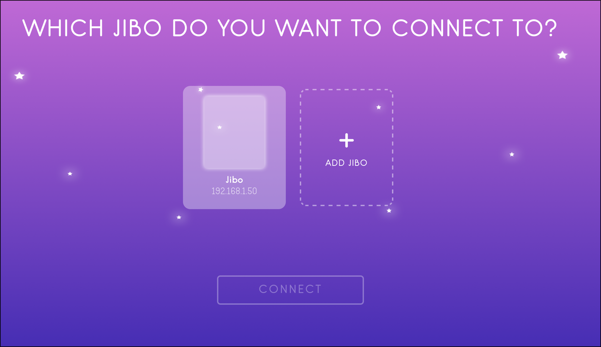

Be-a-Maker Revived is our version of the discontinued Be-A-Maker app for iOS and Android. It can be installed in a few simple commands.

## Required Tools
You will need a few things to use this
- git
- npm & node

## Download and Run
First we are going to clone and enter the git repository
```bash
git clone https://github.com/Jibo-Revival-Group/Be-A-Maker
cd Be-A-Maker
```
Next we will setup and run the project!
```bash
cd web
npm install
node server.js
```
## Open the WebUI
Now that we have the server running in the background, we are gonna open the WebUI! On the same computer you are using to run the commands above, you want to open a browser and go to localhost:5173 (or just click [this link](http://localhost:5173))
## Connect to a Jibo
You should now be on this menu



From here you want to click on the small field that says "192.168.1.50" and enter your Jibo's IP Address, then click connect. Your Jibo should now have a purple/pink ring and have a dot in the bottom right of his screen with the same color.
You are now in Be-A-Maker! Using the scratch blocks you can code him to do different things. When you are done, open the menu via the button on the top left and click Disconnect.