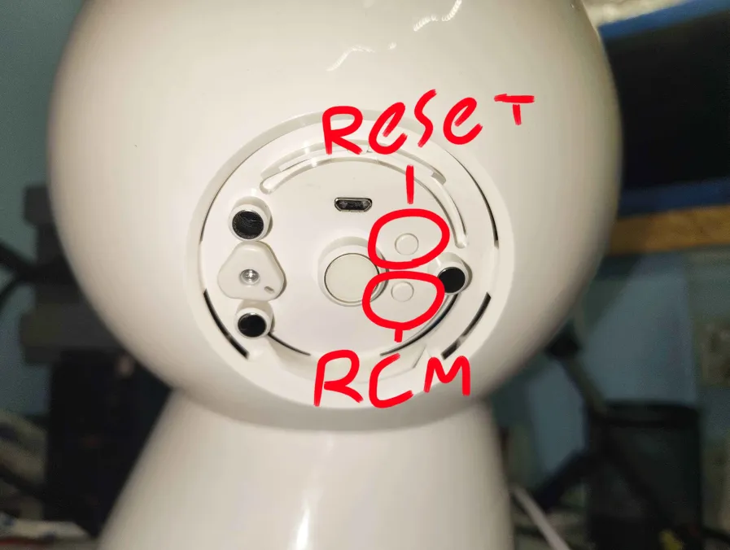

:::tip[Info]{icon="information"}
The modding process is entirely reversible. If you want to later unmod your robot you can (assuming you do full dump) revert back to before you started the mod.
:::

Usually, Jibo is in "normal" mode. Normal mode blocks most/all ports (including most importantly, port 22) on the robot, which isn't something we want. Instead, (using the JiboAutoMod tool) we want him to run using "int-developer" mode (which is short for internal developer)

## Requirements
- Machine running Linux (Debian-based (Ubuntu, Raspberry Pi OS, etc) or Arch-based)
- ~20gb of storage available
- Micro-USB **data** cable (must be capable of transferring data)
- a Jibo connected to Wi-Fi
- Python 3.8+
- Git
- Access to a Package Manager
- 1-4 hours of free time

## Get Jibo's IP Address
On Jibo's menu scroll all the way to the right and open **Settings --> Wi-Fi**, and find his local IP address (192.168.x.x format). Once you have it, write it down somewhere so you can use it later.
## Download JiboAutoMod
Using these commands, download JiboAutoMod
```bash
git clone https://github.com/Jibo-Revival-Group/JiboAutoMod.git
cd JiboAutoMod
```
## Install Dependencies
The command used differs depending on which distro you use.
### Debian-based Distro
(This includes Raspberry Pi OS)
```bash
sudo apt update
sudo apt install build-essential libusb-1.0-0-dev git python3 python3-pip gcc-arm-none-eabi libnewlib-arm-none-eabi
```
### Arch-based Distro
```bash
sudo pacman -S --needed base-devel libusb git python python-pip arm-none-eabi-gcc arm-none-eabi-newlib
```
## Enter RCM on Jibo
The buttons on the back of Jibo allow you to enter RCM (**R**e**C**overy **M**ode). In RCM, we are able to read/write to his eMMC storage, allowing us to edit his mode file to int-developer instead of normal.



As shown in this image, the bottom button is for RCM. What you want to do is (in this order):
- Shutdown Jibo
- Open back hatch
- Hold RCM button
- While holding RCM button, press the power button

After you've done that, his red LED should be on and remain on. If that is happening, congrats you're in RCM!
## Connect to Computer
Now that he is in RCM, you want to connect him to your computer! Using your data micro-USB cable, plug his micro-USB port into your computer. To verify he is being detected in RCM run:
```bash
lsusb
```
You should see something like this in the list (it likely won't match exactly):
```bash
Bus 001 Device 007: ID 0955:7740 NVIDIA Corp. APX
```
## Run JiboAutoMod
There are 2 ways to mod your robot. The regular full dump or a /var dump. It is ***heavily*** encouraged you do the full dump rather than the /var dump however it takes longer. There is a tale of a person (who was a fan of Minecraft Dungeons) that didn't backup their robot at all, and it got completely bricked by a mistake they made.
### Full Dump
This dump will take 2-4 hours, but is very safe as it backs up your entire robot rather than just your var partition. From within the JiboAutoMod folder, run JiboAutoMod without any flags:
```bash
python3 jibo_automod.py
```
### Var Dump
:::tip[Warning]{icon="warning"}
This option is very unsafe as it backs up only your var partition rather than your entire robot eMMC. If you make a single mistake that messes something up on your robot, you won't be able to revert to pre-mod.
:::
This dump will take 20-90 minutes, and is very unsafe as it backs up only your var partition rather than your entire robot. You should probably use the full dump instead. From within the JiboAutoMod folder, run JiboAutoMod with a flag:
```bash
python3 jibo_automod.py --mode-json-only
```
## Wait
As your robot dumps you have to wait a decent amount of time. I encourage putting on a movie or long-form video.
## Reboot robot
Now that the command has finished running and your robot has been modded, reboot him! Once Jibo has finished rebooting, you should see a green checkmark instead of Jibo's eye. This means your robot is now modded! Keep the IP address you noted down, as you'll need it for running the Post-Mod script. Cya there! :3