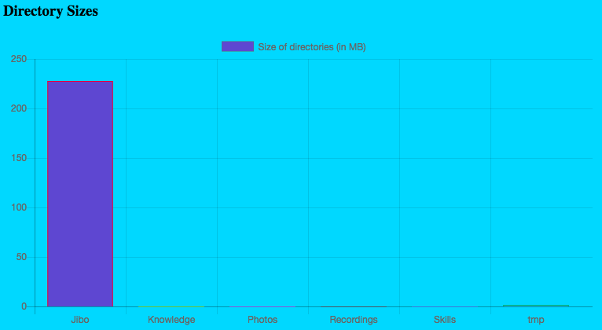
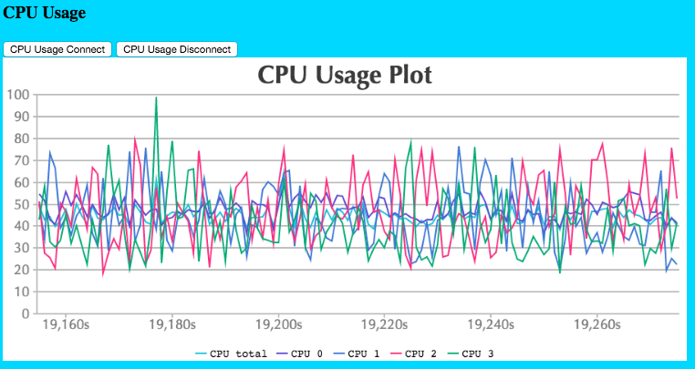
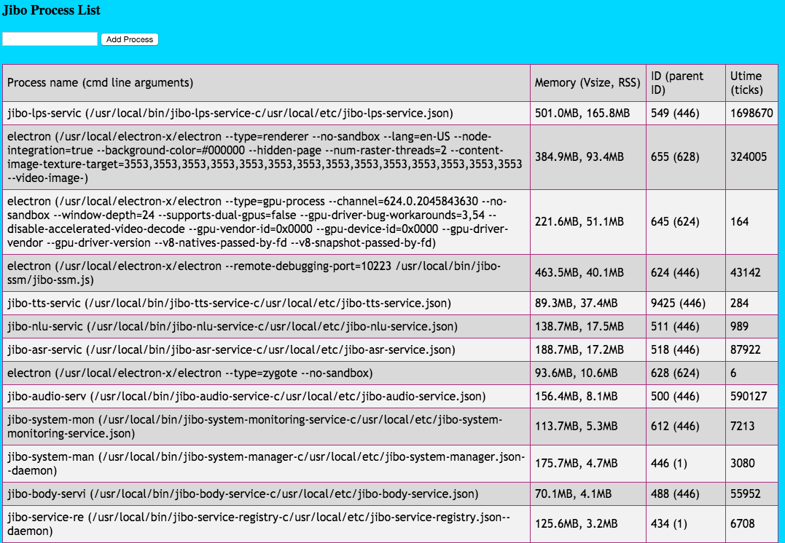
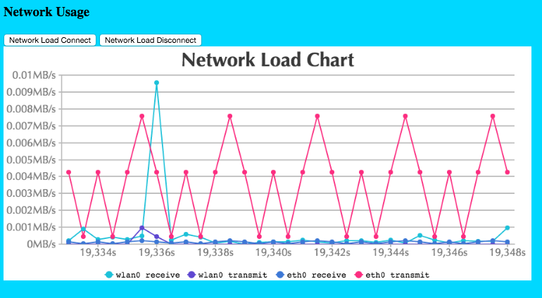
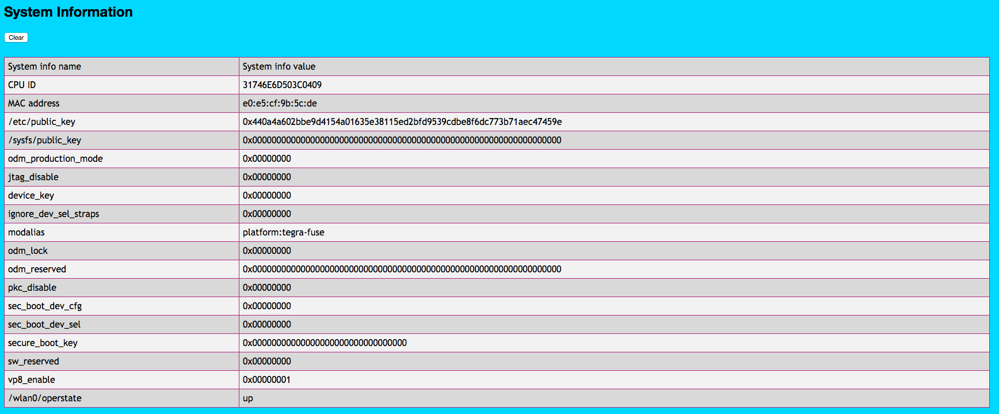
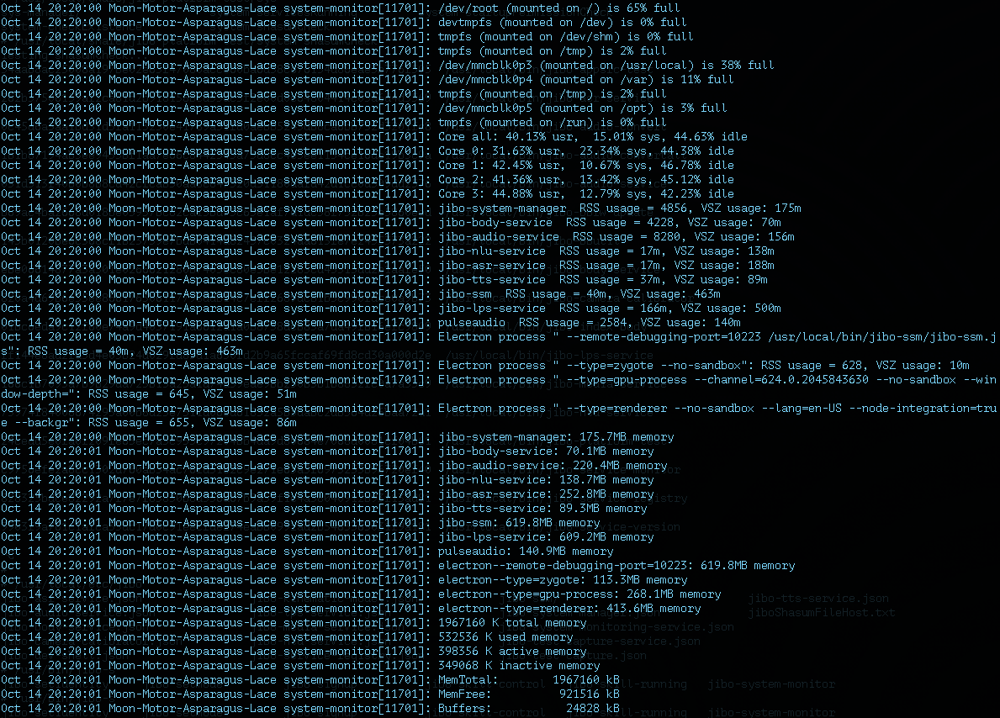

import { FileTree } from '@astrojs/starlight/components';

import { Aside } from '@astrojs/starlight/components';


(Original by: Russell Kirmayer, last modified on 2017-05-25)

The platform team would like to provide a set of steps to help do preliminary diagnosing and debugging of the platform to extract as much information about system problems as possible.  

## System logs
Any time a problem is encountered on Jibo, the logs should always be one of the first things saved (before rebooting) and examined for issues.

When Jibo is in int-developer mode or above, the platform generates a log file which contains a lot of information regarding the system.  These are located in (on the robot):
```sh
/var/log/
```

The name of the log file is messages.  If Jibo has his credentials set, there will be other log files within the directory (messages.1, etc.) but 

In the event of an issue, please copy at minimum messages off the robot:

```sh
// From your desktop, or in a terminal off the robot, type:
~$ scp root@172.24.84.101:/var/log/messages .
// Don't forget the period at the end
```


## Core dumps
Certain conditions on the system will cause a jibo service to generate a core dump, which "consists of the recorded state of the working memory of a computer program at a specific time, generally when the program has crashed or otherwise terminated abnormally" (Wikipedia).

Here are steps below to extract the most information:

On generation of a core dump, it will be sent to directory: 
```sh
~$ /opt/coredumps/
```

The name of the core dump will be `PROCESSNAME.PID.core`.  It will look like this example:
```sh
~$ /opt/coredumps/jibo-tts-servic.9407.core
```

To extract useful information from this file, it will need to be run through a program called GDB.  This program lives on the robot.  To run GDB on the core dump, type, for example:
```sh
// GDB [ABSOLUTE PATH TO SERVICE] [ABSOLUTE PATH TO CORE DUMP]
~$ gdb /usr/local/bin/jibo-tts-service /opt/coredumps/jibo-tts-servic.9407.core
```
Running the program will produce output similar to what's seen before, eventually showing the gdb prompt (gdb):
```sh
GNU gdb (GDB) 7.9.1
...
...
Using host libthread_db library "/lib/libthread_db.so.1".
Core was generated by `/usr/local/bin/jibo-tts-service -c /usr/local/etc/jibo-tts-service.json'.
Program terminated with signal SIGSEGV, Segmentation fault.
#0  0xb68fe656 in __libc_do_syscall () from /lib/libpthread.so.0
(gdb)
```

```sh
At this point, here are a list of commands that will produce output you can run in GDB to get important information (random order):

(gdb) run
(gdb) bt
```


## Shasum check
All non-production platform builds now contain a file which has the shasum value for all Jibo specific binaries and configuration files.  The file is generated by buildroot when making a platform build, ensuring the shasum generated is un-modified on the robot.  The file generated is:

`usr/local/etc/jiboShasumFileSrc.txt`
It looks something like this:
```sh
Shasums created with sha256sum -t <file>
54aab8ac25008a197be02e63f47080acc860ba6d38c676154d86eae3b776f505 output/target/usr/local/bin/jibo-appsrc-test
262b37506159af2ca81d2b918158bcd55dc3f2e00d0e64804414c05a6d4d5569 output/target/usr/local/bin/jibo-asr-service
(......)
c51d081ad60612de73487903b5f8ca2684d5f7bff9c191d2ba4a715f7490f4d4 output/target/usr/local/etc/jibo-test-capture-service.json
625847262a74c8fc9c399492b310ca0549567858050fb7ba61f6491e003cf14c output/target/usr/local/etc/jibo-tts-service.json
```


To ensure that Jibo contains the right version of Jibo binaries and configuration files, the platform test program will generate an identically-formatted shasum file live on Jibo.  The file generated is:

`/usr/local/etc/jiboShasumFileHost.txt`


This file can be generated by running either of the two commands.  The first runs specifically the shasum file generation program, the second runs the entire platform test suite, including the shasum program:
```sh
// Just the shasum file generation program
~$ /usr/local/share/jibo-platform-test/system-shasumCheck
// Run the entire platform test suite
~$ jibo-platform-test
```

To check the differences, you can do one of 2 things:

 - Visually inspect the difference in shasums between the expected (buildroot-generated shasum) and on-robot shasum values.
 - Diff the two files


This process can help determine the exact version of the binary or configuration file Jibo has

## System Monitoring Service
The platform team has a service which monitors various information about the performance of Jibo's system.  See the System Monitoring Service Confluence page for more detailed information.

In `int-developer` mode, the monitoring service runs just like the other platform services (audio, body, etc.) and has an interactive webpage.  This can be accessed via the service registry, or at:

 
```sh
// In a web browser
[ROBOT-IP]:4111/index.html
// example: http://172.24.84.101:4111/index.html
```


This page provides real time plots of the information, directory sizes, process memory usage, and more.  Example visualization can be seen in these images:








## System Monitor Script
All builds periodically log system stats and information to /var/log/messages.  The program is
```sh
~$ /usr/bin/jibo-system-monitor --m --s --c --p

```


This program is run automatically by the system every 5 minutes, but also can be triggered manually by calling the command above.  

An example output looks like this (see below), via this command (elipses denote shortening of the output for the sake of Confluence brevity):
```sh
// Search the system messages for output from the system monitoring script
~$ grep system-monitor /var/log/messages
Oct 14 20:20:00 Moon-Motor-Asparagus-Lace system-monitor[11701]: /dev/root (mounted on /) is 65% full
(......)
Oct 14 20:20:00 Moon-Motor-Asparagus-Lace system-monitor[11701]: /dev/mmcblk0p5 (mounted on /opt) is 3% full
Oct 14 20:20:00 Moon-Motor-Asparagus-Lace system-monitor[11701]: tmpfs (mounted on /run) is 0% full
Oct 14 20:20:00 Moon-Motor-Asparagus-Lace system-monitor[11701]: Core all: 40.13% usr,  15.01% sys, 44.63% idle 
(......)
Oct 14 20:20:00 Moon-Motor-Asparagus-Lace system-monitor[11701]: jibo-system-manager  RSS usage = 4856, VSZ usage: 175m
Oct 14 20:20:00 Moon-Motor-Asparagus-Lace system-monitor[11701]: jibo-body-service  RSS usage = 4228, VSZ usage: 70m
(......)
Oct 14 20:20:00 Moon-Motor-Asparagus-Lace system-monitor[11701]: jibo-lps-service  RSS usage = 166m, VSZ usage: 500m
Oct 14 20:20:00 Moon-Motor-Asparagus-Lace system-monitor[11701]: pulseaudio  RSS usage = 2584, VSZ usage: 140m
Oct 14 20:20:00 Moon-Motor-Asparagus-Lace system-monitor[11701]: Electron process " --remote-debugging-port=10223 /usr/local/bin/jibo-ssm/jibo-ssm.js": RSS usage = 40m, VSZ usage: 463m
(......)
Oct 14 20:20:00 Moon-Motor-Asparagus-Lace system-monitor[11701]: jibo-system-manager: 175.7MB memory
(......)
Oct 14 20:20:01 Moon-Motor-Asparagus-Lace system-monitor[11701]: electron--type=renderer: 413.6MB memory
(......)
Oct 14 20:20:01 Moon-Motor-Asparagus-Lace system-monitor[11701]: 349068 K inactive memory
Oct 14 20:20:01 Moon-Motor-Asparagus-Lace system-monitor[11701]: MemTotal:        1967160 kB
Oct 14 20:20:01 Moon-Motor-Asparagus-Lace system-monitor[11701]: MemFree:          921516 kB
Oct 14 20:20:01 Moon-Motor-Asparagus-Lace system-monitor[11701]: Buffers:           24828 kB
```



