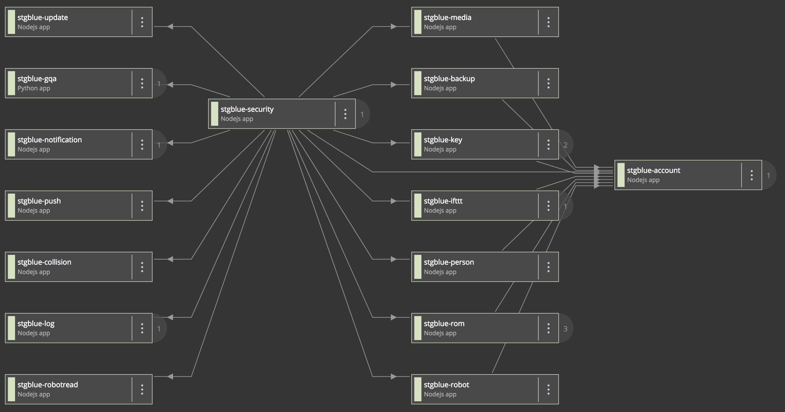

import { FileTree } from '@astrojs/starlight/components';

import { Aside } from '@astrojs/starlight/components';

(Original by: Dmytro Milashenko)

# Github

## Classic Services
(depricated link) https://github.com/jiborobot

 - 25 repositories (0 recovered)
 - Each classic service/microservice is its own repository
 - Developed by Alex and Dmytro
 - Uses jibo-service-client (JSC) for communication
 - account-service, loop-service , robot-service , mobile , etc.

 All classic services (except UI) have the following structure:

<FileTree>
- /src/
  - clients/ (code with clients for external systems. facebook , ifttt, other jibo classic services)
  - controllers/ (code with main logic in it aka. service layer)
  - errors/ (list of error codes)
  - handlers/ (code that maps webrequests to controller `service` layer calls)
  - routes/ (internal REST api consumed by other classic services NO AUTH performed here.)
  - schemes/ (database Mongoose chemes. If you need to get what data each service stores, check here)
  - utils/ (code snippets reused in multiple places within the same service)
- index.js (service startup file for local Development. use `ts-node/register` to transpile Typescript on demand)
- dst.js (production startup file. use `/dst` folder (created on build time) with code transpiled by TS transpiler)
- Dockerfile (file used to build the docker image)
</FileTree>

## Pegasus Services

(depricated link) https://github.com/jiboV2/pegasus/pulls

The Pegasus services do NOT use JSC. Instead they use a websocket to connect to the hub service , and the hub routes to everything else

<Aside type="caution">URLs in the table are depricated.</Aside>

| Service Name | Brief Description | Team | API | Src |
| :--- | :--- | :--- | :--- | :--- |
| **account** | Service that manages Account & Loop entities | Server | [Account](http://doc-server.jibo.com/latest/AWS/Account.html) • [AccountAdmin](http://doc-server.jibo.com/latest/AWS/AccountAdmin.html) • [Loop](http://doc-server.jibo.com/latest/AWS/Loop.html) | [srv-account-ws](https://github.com/jiboV2/pegasus/tree/milashenko/docker-compose/cloud-services/srv-account-ws) |
| **app-toolkit-manager** | Service to manage clientIds and ACOs for the oauthclients connecting using the App Toolkit | Server, Toolkit | Entrypoint URLs on [DevOps Wiki](http://confluence.jibo.media.mit.edu/x/LACr.html) | [srv-app-toolkit-manager](https://github.com/jiborobot/srv-app-toolkit-manager) |
| **backup** | Service to let robot backups to cloud | Server | [Backup](http://doc-server.jibo.com/latest/AWS/Backup.html) | [srv-backup-ws](https://github.com/jiborobot/srv-backup-ws/) |
| **chitchat-skill** | *N/A* | Pegasus | *N/A* | [chitchat-skill](https://github.com/jiboV2/pegasus/tree/fajita/packages/chitchat-skill) |
| **cleanup** | *Unknown* | *Unknown* | *Unknown* | *Unknown* |
| **collision** | Service that resolves user names collisions | Server | [Collision](http://doc-server.jibo.com/latest/AWS/Collision.html) | [srv-collision-ws](https://github.com/jiborobot/srv-collision-ws/) |
| **customer-portal** | Web front end for tasks like Reset Password, Confirm Email, etc. | Server | *N/A* | [srv-customer-portal](https://github.com/jiborobot/srv-customer-portal) |
| **entrypoint-socket** | Endpoint that exposes WebSocket for robot works in integration with notifications service. | Server | *N/A* | [srv-entrypoint-socket-ws](https://github.com/jiborobot/srv-entrypoint-socket-ws/) |
| **gqa** | General Questions and Answers (Python) | Tom Donahue | *N/A* | [srv-gqa-ws](https://github.com/jiborobot/srv-gqa-ws) |
| **hub** | *N/A* | Pegasus | *N/A* | [hub](https://github.com/jiboV2/pegasus/tree/fajita/packages/hub) |
| **ifttt** | Service that provides integration with ifttt.com | Server | [IFTTT](http://doc-server.jibo.com/latest/AWS/IFTTT.html) | [srv-ifttt-ws](https://github.com/jiborobot/srv-ifttt-ws/) |
| **key** | Service that manages keys for robot-server-mobile data encryption | Server | [Key](http://doc-server.jibo.com/latest/AWS/Key.html) | [srv-key-ws](https://github.com/jiborobot/srv-key-ws/) |
| **log** | Service that provides ability to send robot logs to the cloud | Server | [Log](http://doc-server.jibo.com/latest/AWS/Log.html) • [LogAdmin](http://doc-server.jibo.com/latest/AWS/LogAdmin.html) | [srv-log-ws](https://github.com/jiborobot/srv-log-ws/) |
| **logparser** | Service that parses ASR and NLU logs from robots (ES/S3) | Conversational Analytics | *N/A* | [logparser](https://github.com/jiborobot/logparser) |
| **lps** | *Unknown* | *Unknown* | *Unknown* | *Unknown* |
| **media** | Service to upload media from robot/mobile to the cloud | Server | [Media](http://doc-server.jibo.com/latest/AWS/Media.html) • [MediaAdmin](http://doc-server.jibo.com/latest/AWS/MediaAdmin.html) | [srv-media-ws](https://github.com/jiborobot/srv-media-ws/) |
| **notification** | Service that manages Robot and Mobile notifications in response to various events. | Server | [Notification](http://doc-server.jibo.com/latest/AWS/Notification.html) | [srv-notification-ws](https://github.com/jiborobot/srv-notification-ws/) |
| **oauthclients** | *N/A* | *N/A* | *N/A* | [srv-oauth-clients-ws](https://github.com/jiborobot/srv-oauth-clients-ws) |
| **parser** | *Unknown* | *Unknown* | *Unknown* | *Unknown* |
| **person** | Service that manages various aspects of person-specific properties, e.g., holidays. | Server | [Person](http://doc-server.jibo.com/latest/AWS/Person.html) | [srv-person-ws](https://github.com/jiborobot/srv-person-ws/) |
| **poll** | Service that pulls AP News feed for use by GQA (pushes into MongoDB) | CAI/Conversation X-Team | Deprecated (Fajita update) | [srv-poll-ws](https://github.com/jiborobot/srv-poll-ws) |
| **push** | Service to deliver mobile notifications | Server | [Push](http://doc-server.jibo.com/latest/AWS/Push.html) | [srv-push-ws](https://github.com/jiborobot/srv-push-ws/) |
| **redis** | Redis used to mediate events for robot to robotread services, and as a cache for security-gw | Server | *N/A* | *N/A* |
| **robot** | Service that consumes robot manufacturing/lifecycle events | Server | [Robot](http://doc-server.jibo.com/latest/AWS/Robot.html) • [RobotAdmin](http://doc-server.jibo.com/latest/AWS/RobotAdmin.html) | [srv-robots-ws](https://github.com/jiborobot/srv-robots-ws) |
| **robotread** | Service that provides snapshot of robot states, based on manufacturing/lifecycle events | Server | *N/A* | [srv-robots-read-ws](https://github.com/jiborobot/srv-robots-read-ws/) |
| **rom** | Service that implements ROM | Server | [ROM](http://doc-server.jibo.com/latest/AWS/ROM.html) | [srv-rom-ws](https://github.com/jiborobot/srv-rom-ws/) |
| **salesforce** | Facade for integration with Salesforce | Server | *N/A* | [srv-salesforce-ws](https://github.com/jiborobot/srv-salesforce-ws) |
| **saml** | SAML Auth endpoint | Server | *N/A* | [srv-saml-ws](https://github.com/jiborobot/srv-saml-ws) |
| **security** | Authentication Gateway for APIs | Server | *N/A* | [srv-security-gw](https://github.com/jiborobot/srv-security-gw/) |
| **update** | Service that provides robots information about available updates. | Server | [Update](http://doc-server.jibo.com/latest/AWS/Update.html) • [UpdateAdmin](http://doc-server.jibo.com/latest/AWS/UpdateAdmin.html) | [srv-update-ws](https://github.com/jiborobot/srv-update-ws/) |

Service map captured with NewRelic

